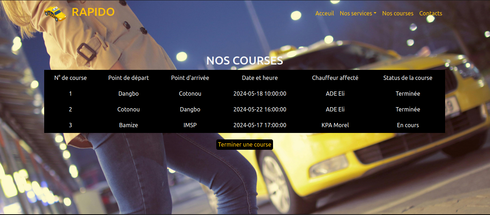

INSTITUT DE MATHÉMATIQUES ET DE SCIENCES PHYSIQUES

RAPPORT DE TP

Rédigé par:    								     Supervisé par:
Eliel Ezéchiel ADECHIAN					  Dr Amadou T. SANDA

PLAN

INTRODUCTION

I- PRÉSENTATION DU SUJET

II- SCHÉMA RELATIONNEL DE LA BASE DE DONNÉE

III- RÉALISATION

CONCLUSION

INTRODUCTION

Dans le cadre de ce travail pratique, nous avons été chargés de développer une application web pour la gestion des courses de taxis pour l'entreprise RAPIDO. 

Cette application vise à optimiser la gestion des courses effectuées par les taxis de la compagnie, en fournissant des fonctionnalités telles que l'affichage des courses, l'ajout de nouvelles courses, l'affectation des chauffeurs et la mise à jour des statuts des courses.

Dans ce document, nous présenterons en détail notre approche pour répondre à ce défi. Nous commencerons par une présentation du sujet, en exposant les exigences fonctionnelles de l'application et les attentes de l'entreprise RAPIDO. Ensuite, nous fournirons un schéma relationnel de la base de données que nous avons conçu pour stocker les informations pertinentes. Enfin, nous détaillerons les différentes étapes de réalisation de l'application, en mettant en lumière les choix technologiques, les défis rencontrés et les solutions apportées.

I- PRÉSENTATION DU SUJET

L'application de gestion des courses de taxis pour RAPIDO vise à transformer radicalement la façon dont l'entreprise planifie, suit et gère ses courses. Parmi ses fonctionnalités clés, on retrouve la possibilité d'afficher en temps réel toutes les courses effectuées par les taxis de la compagnie, avec des détails précis tels que le point de départ, le point d'arrivée, la date et l'heure, ainsi que le chauffeur affecté et le statut de la course.
Mais l'application ne s'arrête pas là. Elle permet également aux opérateurs d'ajouter facilement de nouvelles courses, en saisissant simplement les informations nécessaires telles que le point de départ, le point d'arrivée et l'heure prévue. De plus, elle offre la possibilité d'affecter rapidement un chauffeur disponible à une course en attente, en sélectionnant simplement son nom dans une liste déroulante. Enfin, elle permet de mettre à jour instantanément le statut d'une course en "terminée" dès que le chauffeur a achevé sa mission, assurant ainsi une traçabilité complète de toutes les activités.

II- SCHÉMA RELATIONNEL DE LA BASE DE
DONNÉE

Voici les structures de table utilisées dans la base de donnée nommée ‘rapido’ : 

courses (course_id, pointDepart, pointArrivee, dateHeure, #chauffeur_id, status)

chauffeurs (chauffeur_id, nom, prenoms, telephone, sexe, disponible)

course_id, chauffeur_id sont de type INT,
pointDepart, pointArrivee, status, nom, prenoms et sexe sont de type VARCHAR,
dateHeure est de type datetime,
telephone est de type BIGINT,
et disponible est de type BOOLEAN (1 pour disponible et 0 sinon).

III- RÉALISATION

Dans cette section, nous décrivons en détail le processus de développement de l'application web de gestion des courses de taxis pour l'entreprise RAPIDO. Cette partie est structurée autour des étapes clés de la réalisation du projet : le développement de l'interface utilisateur, l'implémentation de la logique de gestion des données, et les tests et validations.

1. Développement de l'Interface Utilisateur
L'interface utilisateur a été développée en utilisant HTML, CSS avec le framework BOOTSTRAP et pour assurer une expérience utilisateur fluide et réactive. Voici les principales pages de l'application :
    • Page d'accueil : Affiche un formulaire permettant à un opérateur d'ajouter une nouvelle course en saisissant le point de départ, le point d'arrivée, et la date et l'heure prévues.
    
    • Page des courses en attentes: Liste toutes les courses avec des informations détaillées telles que l'ID de la course, le point de départ, le point d'arrivée, la date et l'heure, affiche une liste déroulante des chauffeurs disponibles pour affecter un chauffeur à une course en attente, et le statut de la course (en attente).
    
    • Page des courses en cours et terminée : Liste toutes les courses avec des informations détaillées telles que l'ID de la course, le point de départ, le point d'arrivée, la date et l'heure, le chauffeur affecté, et le statut de la course ( en cours ou terminée).
    
    • Page des courses en cours : Liste toutes les courses avec le status en cours et un bouton permettant de terminer une course en cours.
    
    • Page de Contact : Affiche quelques contacts.
    
   
3. Implémentation de la Logique de Gestion des Données (Back-End)
Pour gérer les données, nous avons configuré notre environnement de développement en installant XAMPP. Nous avons utilisé les technologies Ajax et Jquery.
Voici la structure des principales tables tous décrit dans le fichier install.php :
    • Table des Courses : Contient les champs id, pointDepart, pointArrivee, dateHeure, chauffeur_id, et status.
    • Table des Chauffeurs : Contient les champs id, nom, prenoms, telephone, sexe et disponibilite.
La relation entre les tables "Courses" et "Chauffeurs" est gérée via une clé étrangère (chauffeur_id) dans la table des Courses, permettant de lier chaque course à un chauffeur spécifique.
Nous avons créé : 
- le fichier insertChauffeur.php pour insérer les Chauffeurs dans la base de donnée,
- le fichier insertCourse.php pour gérer le CRUD des courses,
- le fichier miseAJour.php pour gérer la mise a jour dans la base de donnée de la disponibilité des chauffeurs et le status (devient ‘en cours’) des courses lorsque l’opérateur affecte une chauffeur a un course,
- le fichier courseTermine.php pour mettre le status de la course à ‘terminée’.
3. Tests et Validation
Une fois le développement terminé, nous avons procédé à une série de tests pour garantir la qualité et la fiabilité de l'application. Les tests effectués incluent :
    • Tests d'intégration : Pour s'assurer que les différents modules de l'application fonctionnent correctement ensemble.
    • Tests fonctionnels : Pour valider que les fonctionnalités répondent aux exigences spécifiées.
    • Tests utilisateurs : Réalisés avec des personnes lambda pour vérifier l’usage intuitif de l’application.
Les résultats des tests ont été positifs, confirmant que l'application répondait aux besoins et exigences du TP. Des ajustements mineurs ont été réalisés en fonction des retours des utilisateurs.

CONCLUSION

Le développement de l'application web de gestion des courses de taxis pour l'entreprise RAPIDO a été un projet enrichissant. Cette section de conclusion aborde les réalisations, les impressions obtenues au cours du développement, ainsi que les perspectives pour l'avenir.
Réalisations:
Le projet a abouti à la création d'une application web complète et fonctionnelle, qui intègre plusieurs fonctionnalités essentielles pour la gestion efficace des courses de taxis :
    • Développement de l'interface utilisateur : Nous avons conçu une interface utilisateur intuitive et réactive, utilisant HTML, CSS et le framework Bootstrap, qui permet aux opérateurs de gérer facilement les courses, depuis l'ajout de nouvelles courses jusqu'à la mise à jour de leur statut.
    • Implémentation de la logique de gestion des données : En configurant un environnement de développement avec XAMPP et en utilisant Ajax et jQuery, nous avons développé une back-end. Les principales opérations de gestion des données sont réalisées via des scripts PHP dédiés, garantissant une manipulation efficace des données.
    • Gestion des relations entre entités : La conception de la base de données avec des tables interconnectées pour les courses et les chauffeurs assure une gestion cohérente et intégrée des informations.
    • Tests et validations : Des tests approfondis, incluant des tests d'intégration, fonctionnels et utilisateurs, ont été effectués pour garantir la qualité, la fiabilité et la facilité d'utilisation de l'application. 
Impressions:
Le développement de cette application a fourni plusieurs enseignements et impressions :
    • Apprentissage et amélioration des compétences : Ce projet a permis d'approfondir nos compétences en développement web, en particulier dans l'utilisation de PHP pour le back-end, et des technologies front-end telles que Bootstrap, Ajax et jQuery.
Perspectives:
Les perspectives pour l'avenir sont prometteuses, avec plusieurs axes d'amélioration et d'extension envisagés :
    • Fonctionnalités supplémentaires : Il serait pertinent d'ajouter des fonctionnalités avancées telles que la géolocalisation des taxis en temps réel, l'envoi d'alertes automatiques aux chauffeurs et aux opérateurs, et la génération de rapports analytiques pour la direction.
    • Intégration avec d'autres systèmes : L'application pourrait être intégrée avec d'autres systèmes internes de RAPIDO ou avec des plateformes tierces, afin de favoriser une meilleure interopérabilité et d'optimiser les opérations.
